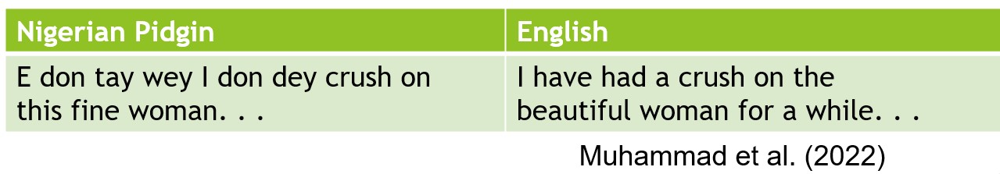

# Zero-shot sentiment classification for Nigerian Pidgin Tweets

This is a project on sentiment classification. A system description paper on the project, written by me and my professor, will be published in the SemEval 2023 proceedings. I'll add a link once that has happened.

The aim of the project is to investigate how using different languages for pre-training and fine-tuning affects the performance of zero-shot sentiment analysis for Twitter data in Nigerian Pidgin. 

Nigerian Pidgin is an English-based Creole language. As a proficient speaker of English, one can easily recognize some of the words:

Nigerian Pidgin is considered low-resource, which is why sentiment classification is still a challenging task for this language, despite being considered practically solved for high-resource languages such as English.

In this project, I use two pre-trained language models: <i>bert-base-uncased</i> (Devlin et al., 2019) and <i>bert-base-multilingual-uncased</i> (Devlin et al., 2019). I then fine-tuned the models separately on three different languages (or language pair in one case), to see how each language would affect the performance on sentiment classification in Nigerian Pidgin. The three languages are

<ul>
<li> English </li>
<li> Nigerian Pidgin </li>
<li> Igbo & Hausa </li>
</ul>

Note that the setup fine-tuning on Nigerian Pidgin is not zero-shot. It is included as a baseline. The data for Nigerian Pidgin, Igbo and Hausa is taken from Muhammad et al. (2023), while the data for English is provided by (Rosenthal et al., 2017). Igbo and Hausa are both Nigerian languages, but unlike English, they share no close linguistic ties with Nigerian Pidgin. 

## References

<ul>
<li>Shamsuddeen Hassan Muhammad, David Adelani, Sebastian Ruder, Ibrahim Sa’id Ahmad, Idris Abdulmumin, Shehu Bello Bello, Monojit Choudhury, Chris Chinenye Emezue, Saheed Salahuddeen Abdullahi, Anuoluwapo Aremu, Alipio Jeorge, and Pavel Brazdil. 2022. Naijasenti: A Nigerian Twitter Sentiment Corpus for Multilingual Sentiment Analysis. In Proceedings of the 13th Language Resources and Evaluation Conference, pages 590–602, Marseille, France. European Language Resources Association.</li>
<li>Jacob Devlin, Ming-Wei Chang, Kenton Lee, and
Kristina Toutanova. 2019. BERT: Pre-training of deep bidirectional transformers for language understanding. In NAACL, pages 4171–4186.
</li>
<li>Shamsuddeen Hassan Muhammad, Idris Abdulmumin,
Abinew Ali Ayele, Nedjma Ousidhoum, David Ifeoluwa
Adelani, Seid Muhie Yimam, Ibrahim Sa’id
Ahmad, Meriem Beloucif, Saif M. Mohammad, Sebastian
Ruder, Oumaima Hourrane, Pavel Brazdil,
Felermino Dário Mário António Ali, Davis David,
Salomey Osei, Bello Shehu Bello, Falalu Ibrahim,
Tajuddeen Gwadabe, Samuel Rutunda, Tadesse Belay,
Wendimu Baye Messelle, Hailu Beshada Balcha,
Sisay Adugna Chala, Hagos Tesfahun Gebremichael,
Bernard Opoku, and Steven Arthur. 2023. AfriSenti:
A Twitter Sentiment Analysis Benchmark for African
Languages.</li>
<li>Sara Rosenthal, Noura Farra, and Preslav Nakov. 2017.
SemEval-2017 task 4: Sentiment analysis in Twitter.
Proceedings of the 11th international workshop
on semantic evaluation (SemEval-2017), pages 502–
518.</li>
</ul>

